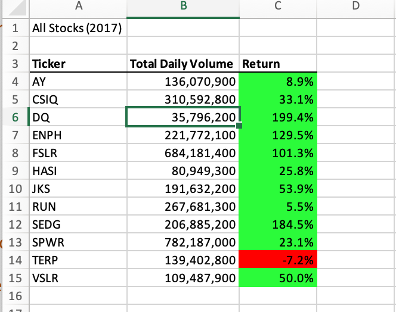
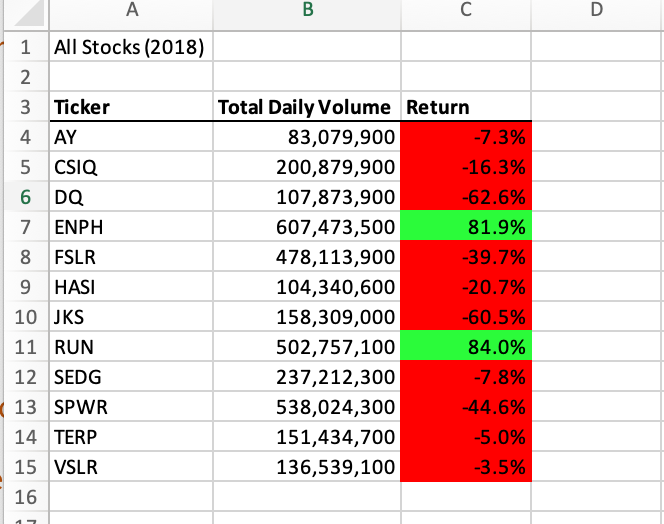

# VBA Challenge
## Overview of Project
The purpose of this project was to create a macro in excel using VBA to be able to analyze the performance of different stocks during a given year quickly.n. For this challenge I repurposed that code that I wrote during Module 2, and measured the performance to make the script run faster.
## Results
### Analysis of Stock Performance
As a result of this analysis, I found that the stocks we were looking at overall performed better in 2017 vs 2018.  In 2017, all except "TERP" had a positive return on investment.  

 
In 2018 however, there were only two stocks that had a positive return on investment, "ENPH" and "RUN". "RUN" in 2017 only had a 5.5% ROI, but increased to 84% in 2018.
 

### Analysis of Refactored Code
Part of the deliverables for this module was to refactor the code I had written so it would run faster.  I refactored the code so it would use a for loop to loop through all the data only one time, which would make it run faster. In my original code before it was refactored it would take 0.6835938 seconds to run when running for the year 2017.  However after I refactored my code it ran in only 0.171875 seconds.

The same was true when running for the year 2018 as well. My previous code would take 0.671875 seconds. My refactored code ran in 0.1914062 seconds.

## Summary
-In summary, I would say there are both advantages and disadvantages to refactoring code.  The advantages would be that it can run faster.  It can also be adaptable for larger data sets.  For example in my original code, it would only run for the stock tickers I wrote into the code.  If you refactored the code it could using variables and for loops it could be used for any stock tickers, not just specific ones.  The disadvantages would be that it could be hard to understand someone else's code if you did not originally write it but are refactoring it.  This drives home the fact that it is really important to write clean code, utilizing white space and comments.  This will make it easier for someone else to look at it and understand what the code is trying to do.  For example in this exercise the original code had comments in it, so it was easy to go step by step and understand what each line of code's purpose was.
